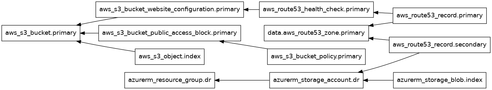
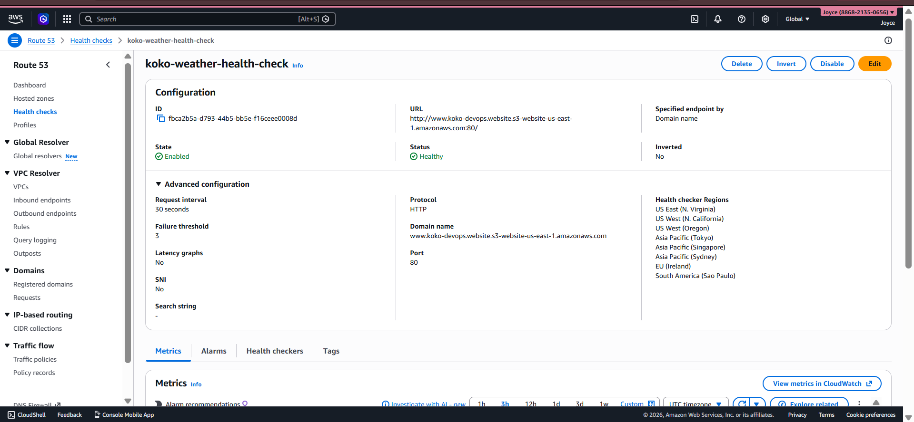
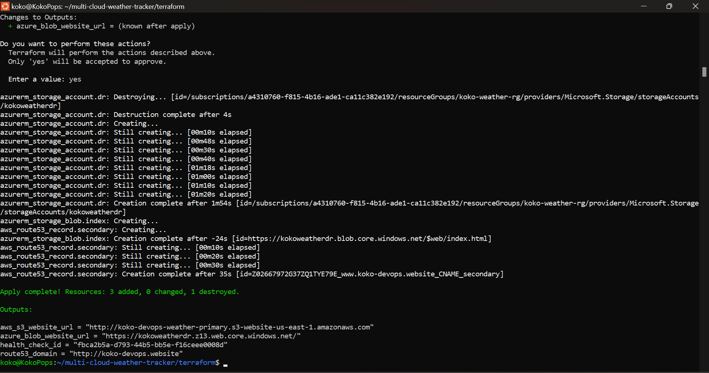
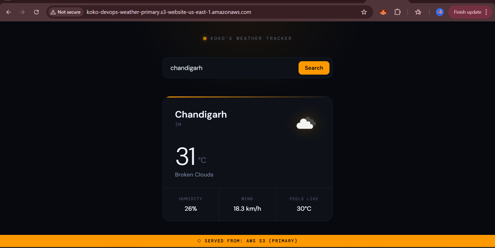
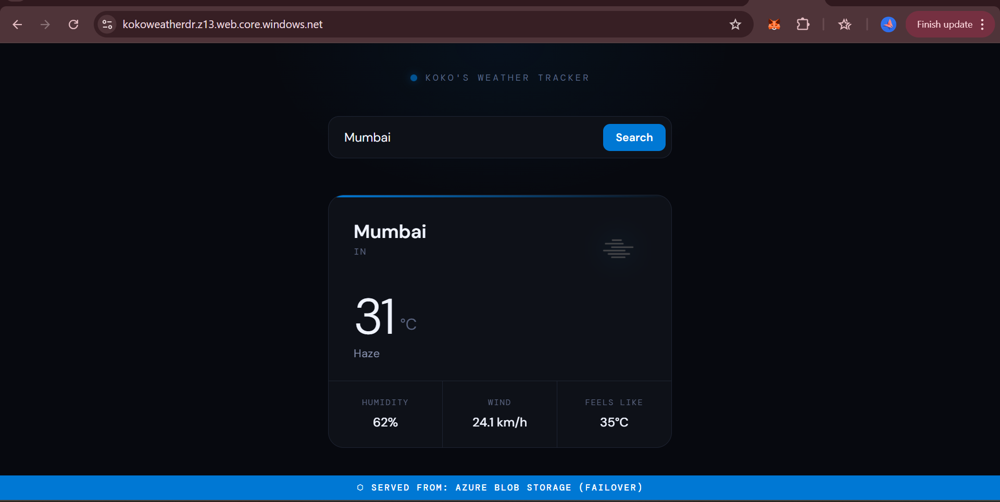
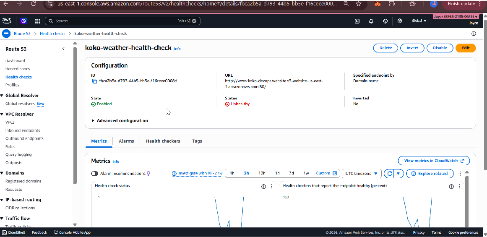
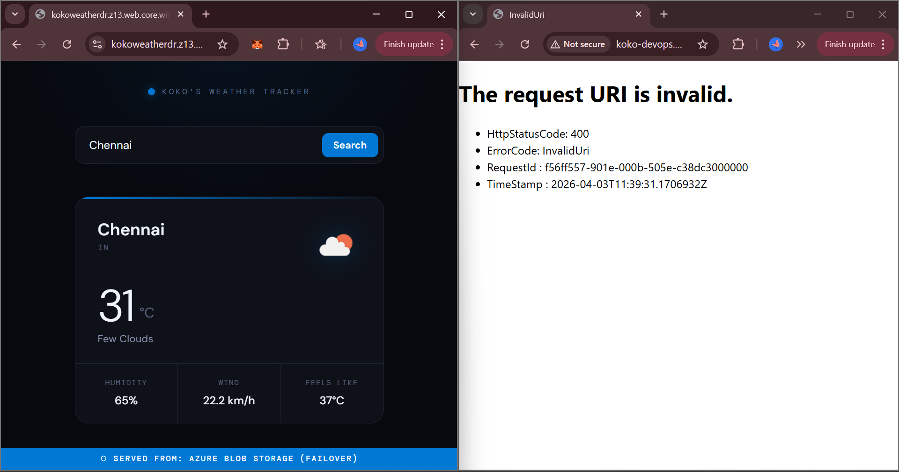
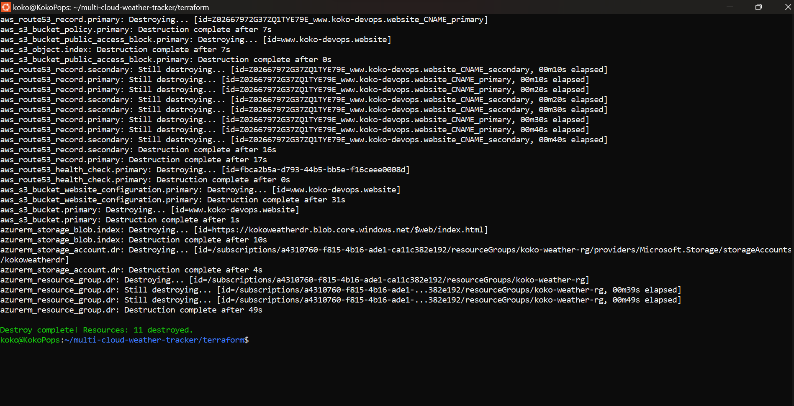

# Multi-Cloud Weather Tracker with Terraform & Disaster Recovery


A production-grade Infrastructure as Code project that deploys a live weather
application across AWS and Azure simultaneously, with automated DNS failover and
disaster recovery — all provisioned and destroyed with a single Terraform command.



---

## What This Project Does

A weather tracking app is deployed to two cloud providers at once. AWS S3 serves
as the primary host. Azure Blob Storage serves as the disaster recovery site.
Route 53 monitors the primary endpoint every 30 seconds and automatically
reroutes all traffic to Azure within 90 seconds of detecting a failure — with
zero manual intervention.

Each environment displays a distinct banner confirming which cloud is actively
serving traffic, making failover events visually verifiable in real time.

---

## Architecture
User Request
|
v
Route 53 DNS (koko-devops.website)
|
|-- [Healthy] --> CNAME --> AWS S3 Static Website (Primary)
|                           www.koko-devops.website.s3-website-us-east-1.amazonaws.com
|
|-- [Unhealthy] --> CNAME --> Azure Blob Storage (Failover)
kokoweatherdr.z13.web.core.windows.net
Route 53 Health Check

Endpoint: S3 website URL
Protocol: HTTP / Port 80
Interval: 30 seconds
Failure threshold: 3 consecutive failures
Checker regions: 8 global locations

Terraform manages all resources across both clouds in a single apply.



---

## Tech Stack

| Layer | Technology |
|---|---|
| Infrastructure as Code | Terraform with AWS (~> 5.0) and AzureRM (~> 3.0) providers |
| Primary Cloud | AWS S3 (static website hosting) + Route 53 |
| Disaster Recovery | Azure Blob Storage (static website) |
| DNS & Failover | Route 53 failover routing policy + health checks |
| Application | Vanilla HTML, CSS, JavaScript |
| Weather Data | OpenWeatherMap Current Weather API |
| Domain | Namecheap registrar, nameservers delegated to Route 53 |
| Dev Environment | WSL2, VS Code, AWS CLI, Azure CLI |

---

## Project Structure
multi-cloud-weather-tracker/
├── app/
│   ├── index.html              # Primary site — AWS orange banner
│   └── index-azure.html        # DR site — Azure blue banner
├── terraform/
│   ├── main.tf                 # Provider declarations
│   ├── variables.tf            # Input variable definitions
│   ├── outputs.tf              # Endpoint URLs and resource IDs
│   ├── aws.tf                  # S3 bucket, policy, website config, file upload
│   ├── azure.tf                # Resource group, storage account, blob upload
│   ├── route53.tf              # Health check, hosted zone lookup, DNS records
│   └── terraform.tfvars        # Variable values — gitignored, never committed
├── .gitignore
└── README.md

---

## Prerequisites

- AWS account with an IAM user configured for programmatic access
- Azure account (note: free trial blocks Azure Front Door and CDN Classic)
- AWS CLI installed and configured
- Azure CLI installed and authenticated
- Terraform v1.0 or later
- A domain name with nameservers pointed at Route 53
- OpenWeatherMap API key (free tier)

---

## Deployment

### 1. Clone the repository
```bash
git clone https://github.com/0seme/multi-cloud-weather-tracker.git
cd multi-cloud-weather-tracker
```

### 2. Create your variable file

Create `terraform/terraform.tfvars` — this file is gitignored and must never
be committed:
```hcl
aws_region                 = "us-east-1"
aws_bucket_name            = "www.your-domain.com"
azure_resource_group_name  = "your-weather-rg"
azure_storage_account_name = "yourweatherdr"
azure_location             = "East US"
domain_name                = "your-domain.com"
weather_api_key            = "your_openweathermap_key"
```

> The S3 bucket name must exactly match the `www.` subdomain of your domain.
> This is a hard requirement of S3 static website hosting when accessed via
> a CNAME record — AWS matches the incoming hostname against the bucket name.

### 3. Add your API key to the app files

In both `app/index.html` and `app/index-azure.html`:
```javascript
const API_KEY = 'your_openweathermap_key_here';
```

### 4. Authenticate both clouds
```bash
aws configure
az login
```

### 5. Initialize, plan, and apply
```bash
cd terraform
terraform init
terraform plan -var-file="terraform.tfvars"
terraform apply -var-file="terraform.tfvars"
```

Terraform provisions all 11 resources across both clouds in a single apply.
Azure storage account creation is the longest step at roughly 2 minutes.



### 6. Verify your endpoints

After apply, three URLs should all serve the weather app:

- **AWS direct:** output as `aws_s3_website_url`
- **Azure direct:** output as `azure_blob_website_url`
- **Custom domain:** `http://www.koko-devops.website`




---

## Disaster Recovery Demo

### Simulate a failure

1. AWS Console → S3 → your bucket → Permissions → Bucket Policy → Edit
2. Delete the entire policy JSON and save
3. The S3 endpoint immediately starts returning 403 errors
4. Route 53 health check flips to Unhealthy within 90 seconds
5. DNS resolution automatically switches to the Azure secondary record
6. Visit `www.koko-devops.website` — the blue Azure banner confirms failover




### Restore primary

1. Paste the original bucket policy back and save
2. Route 53 detects the endpoint healthy within 90 seconds
3. Traffic automatically fails back to AWS — no DNS changes needed

---

## Engineering Decisions Worth Noting

**Why the S3 bucket is named after the www subdomain**
When a CNAME points a custom hostname at an S3 website endpoint, AWS matches
the incoming hostname against the bucket name. The bucket must be named
`www.your-domain.com` exactly — otherwise S3 returns a NoSuchBucket error.

**Why both records are CNAME and not alias**
Route 53 alias records only support AWS-native targets like CloudFront and ELB.
Because the secondary record points to Azure, both records are standard CNAMEs
with a 60-second TTL, which is fully compatible with Route 53 failover policy.

**Why force_destroy is set on the S3 bucket**
Terraform cannot destroy a non-empty bucket. Since all bucket contents are
managed as Terraform resources, force_destroy is safe and ensures a clean
single-command teardown.

**Azure Front Door limitation on free tier**
Azure Front Door Standard would allow the failover to serve traffic on the
same custom domain, making the switch fully transparent at the DNS level.
Azure blocks both Front Door and CDN Classic on free trial accounts. In a
paid production environment this would be resolved with an
`azurerm_cdn_frontdoor_profile` resource and a custom domain association,
with the Route 53 secondary record updated to point at the Front Door
endpoint hostname.

---

## Challenges Encountered

**WSL2 IPv6 routing to Azure APIs**
The Azure Resource Manager API occasionally returns IPv6 addresses. WSL2
does not always handle IPv6 routing correctly, which caused intermittent
connection resets mid-apply. Resolved by temporarily disabling IPv6 at the
WSL2 kernel level before running apply.

**DNS apex CNAME restriction**
Standard DNS does not allow CNAME records at a domain apex. Creating a CNAME
at `koko-devops.website` directly would be rejected. The correct approach is
routing through `www.koko-devops.website`, which is also standard practice
for web-facing domains.

---

## Teardown
```bash
cd terraform
terraform destroy -var-file="terraform.tfvars"
```

Type `yes` when prompted. All 11 resources are destroyed. Verify manually:

- AWS Console → S3: bucket is gone
- AWS Console → Route 53 → Health Checks: list is empty
- AWS Console → Route 53 → Hosted Zone: only NS and SOA records remain
- Azure Portal → Resource Groups: `koko-weather-rg` is gone



---

## License

MIT

---

##  Author

**Joyce (Koko)**
☁️ [@Koko.devops](https://github.com/0seme)

*Part of an ongoing AWS DevOps portfolio — building toward AWS DevOps Professional certification.*
